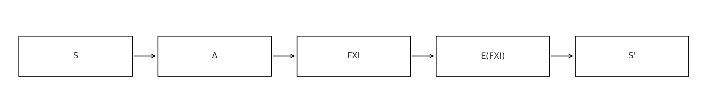

# **Flexionization**

## **Formal Theory of Dynamic Quantitative Equilibrium**

**Document:** Flexionization-Theory-V1.5  
**Version:** 1.5  
**Document Type:** Theoretical Core of the Model  
**Date:** 2025  

---

## Abstract

Flexionization is a mathematical model of dynamic quantitative equilibrium designed to analyze systems in which the structure of an asset pool is maintained through an abstract stabilization operator. The theory introduces a rigorous state space **S**, defining the synthetic pool mass Q_p, the structural mass Q_F, the deviation Δ, and the equilibrium indicator FXI. The system’s dynamics are governed by the equilibrium operator **E(x)**, which determines the sequence of corrective steps.

The model is formulated as a generalized dynamical system with axiomatically defined state transitions. The main results include: the existence and uniqueness of equilibrium; correctness of the dynamics of **FXI** and **Δ**; local and global stability under various classes of equilibrium operators **E**; conditions for convergence to structural equilibrium; and an analysis of critical scenarios in which the system may move outside the theory’s domain of applicability.

Flexionization does not describe market price, trading behavior, or token mechanics. It is a formal model of **structural balance**, intended as a foundational framework for the design of more advanced economic or engineering systems.

---

## Table of Contents

- [Introduction](#introduction)
- [Background and Model Motivation](#background-and-model-motivation)
- [0.0. Notation System](#00-notation-system)

- [1.0. State Space](#10-state-space)
  - [1.1. Definition of State](#11-definition-of-state)
  - [1.2. The State Space](#12-the-state-space)
  - [1.3. Minimal Requirements](#13-minimal-requirements)

- [2.0. Axiomatic Foundation](#20-axiomatic-foundation)
  - [Axiom 1 (State Space)](#axiom-1-state-space)
  - [Axiom 2 (Structural Deviation)](#axiom-2-structural-deviation)
  - [Axiom 3 (Equilibrium Indicator FXI)](#axiom-3-equilibrium-indicator-fxi)
  - [Axiom 4 (Equilibrium Operator E)](#axiom-4-equilibrium-operator-e)
  - [Axiom 5 (Admissibility of Mass Adjustments)](#axiom-5-admissibility-of-mass-adjustments)
  - [Axiom 6 (Bounded Influence on Δ)](#axiom-6-bounded-influence-on-Δ)
  - [Axiom 7 (Continuity of Transitions)](#axiom-7-continuity-of-transitions)
  - [Axiom 8 (Consistency of Dynamics)](#axiom-8-consistency-of-dynamics)
  - [Axiom 9 (Bounded FXI Dynamics)](#axiom-9-bounded-fxi-dynamics)
  - [Axiom 10 (Existence of a Corrective Step)](#axiom-10-existence-of-a-corrective-step)

- [3.0. Formal Dynamics of Flexionization](#30-formal-dynamics-of-flexionization)
  - [3.1. Evolution of Δ](#31-evolution-of-Δ)
  - [3.2. FXI Dynamics](#32-fxi-dynamics)
  - [3.3. Relationship Between Δ and FXI](#33-relationship-between-Δ-and-fxi)
  - [3.4. Conditions for Dynamic Correctness](#34-conditions-for-dynamic-correctness)

- [4.0. Flexionization Theorems](#40-flexionization-theorems)
  - [Theorem 1 (Uniqueness of Equilibrium)](#theorem-1-uniqueness-of-equilibrium)
  - [Theorem 2 (Correctness of FXI Dynamics)](#theorem-2-correctness-of-fxi-dynamics)
  - [Theorem 3 (Corrective Transition)](#theorem-3-corrective-transition)
  - [Theorem 4 (Correctness of Δ)](#theorem-4-correctness-of-Δ)
  - [Theorem 5 (Local Monotonicity)](#theorem-5-local-monotonicity)
  - [Theorem 6 (Stability of Equilibrium)](#theorem-6-stability-of-equilibrium)
  - [Theorem 7 (Global Convergence)](#theorem-7-global-convergence)
  - [Theorem 8 (Reachability of Equilibrium)](#theorem-8-reachability-of-equilibrium)

- [5.0. Critical Scenarios (Edge Cases)](#50-critical-scenarios-edge-cases)
  - [5.1. Asset Unavailability](#51-asset-unavailability)
  - [5.2. Dynamic Weight Adjustments](#52-dynamic-weight-adjustments)
  - [5.3. Partial Execution](#53-partial-execution)
  - [5.4. Constraints on Q_F](#54-constraints-on-q_f)
  - [5.5. External Shocks](#55-external-shocks)
  - [5.6. Loss of Monotonicity in F](#56-loss-of-monotonicity-in-f)
  - [5.7. Failure of E to Produce a Step](#57-failure-of-e-to-produce-a-step)
  - [5.8. Incorrect Parameters U](#58-incorrect-parameters-u)

- [6.0. Appendix A: Examples of Equilibrium Operators E](#60-appendix-a-equilibrium-operators-e)
  - [6.1. Linear Operator E₁](#61-linear-operator-e1)
  - [6.2. Logarithmic Operator E₂](#62-logarithmic-operator-e2)
  - [6.3. Hyperbolic Operator E₃](#63-hyperbolic-operator-e3)
  - [6.4. Notes on Practical Usage](#64-notes-on-practical-usage)

- [7.0. Appendix B: Economic Interpretation](#70-appendix-b-economic-interpretation)
  - [7.1. Interpretation of Qₚ](#71-interpretation-of-q_p)
  - [7.2. Interpretation of Q_F](#72-interpretation-of-q_f)
  - [7.3. Interpretation of Δ](#73-interpretation-of-Δ)
  - [7.4. Interpretation of FXI](#74-interpretation-of-fxi)
  - [7.5. Interpretation of E](#75-interpretation-of-e)
  - [7.6. General Meaning of the Model](#76-general-meaning-of-the-model)
  - [7.7. Interpretation Limitations](#77-interpretation-limitations)

- [8.0. Conclusion](#80-conclusion)

- [9.0. Possible Directions for Model Development](#90-possible-directions-for-model-development)

- [10.0. References](#100-references)

---

## Introduction

Mathematical equilibrium models are traditionally used to analyze systems in which the dynamics are determined by interactions between structural quantities, and where the final state tends to converge toward a balanced configuration. Classical examples include general equilibrium models, stochastic supply–demand systems, Markovian dynamical frameworks, and stabilization mechanisms in distributed environments.

Flexionization belongs to this class of models but exhibits several fundamental distinctions. Unlike models centered on price behavior or agent interactions, Flexionization is formulated as a **purely structural equilibrium model**, based on the following principles:

1. The system is characterized by an abstract state **S**, which includes the synthetic pool mass **Qₚ**, the structural mass **Q_F**, and the deviation **Δ** between them.
2. Equilibrium is defined structurally (**Δ = 0**) rather than in market terms.
3. The system’s dynamics are governed by an operator **E**, which acts on the equilibrium indicator **FXI** and determines the intended corrective step.
4. The relationship between the state and **FXI** is strictly monotonic, allowing the system to be described as a dynamical mapping on **ℝ₊**.
5. Transitions between states are bounded and structurally admissible, ensuring correctness of the dynamics.

This formalization allows Flexionization to be interpreted as a **universal structural stabilization framework**, independent of:

- market prices of assets,
- agent behavior,
- automated market-maker formulas,
- any specific economic implementation.

Flexionization-Theory-V1.5 constitutes the rigorous mathematical core of the model.
The document formalizes:

- the state space,
- the axiomatic foundation,
- the dynamics of the deviation **Δ**,
- the dynamics of the equilibrium indicator **FXI**,
- the properties of equilibrium operators **E**,
- stability and convergence theorems,
- and the limits of applicability.

The purpose of the theory is to provide an unambiguous mathematical basis that can serve as a platform for designing complex systems such as:

- dynamic asset pools,
- stabilization feedback loops,
- distributed balancing mechanisms,
- algorithmic structural controllers.

Flexionization does not prescribe any particular economic logic and does not model market behavior; 
it describes the fundamental dynamics of structural equilibrium, which can be applied to any context requiring self-maintaining balance.

---

## Background and Model Motivation

### 1. Structural Systems Require Quantitative Symmetry

Across a broad class of economic and technical systems, the core challenge is to:

- preserve structural relationships,
- prevent the accumulation of imbalances,
- maintain symmetry between components.

Examples of such systems include:

- asset baskets,
- reserve pools,
- aggregated indices,
- proportional allocation mechanisms.

For these systems, correctness is determined by **structural symmetry**, not by market price. 
Flexionization introduces a rigorous definition of structural symmetry through **Δ** and **FXI**.

---

### 2. Most Existing Models Focus on Price, Not Structure

AMMs (e.g., Uniswap), algorithmic stablecoins, and market indices all solve their respective problems, but:

- AMMs regulate price through liquidity curves;
- stablecoins maintain a peg;
- indices mechanically replicate market composition.

None of these frameworks treats **structural equilibrium** as a primary mathematical object. 
Flexionization fills this gap.

---

### 3. The Need for a Universal Corrective Operator

In complex systems, asset quantities may change:

- unevenly,
- asynchronously,
- under external shocks.

Structural deviation **Δ** is natural, 
but the system must be able to correct it consistently.

The equilibrium operator **E** acts as an abstract controller that determines:

- the rate of correction,
- the reaction intensity,
- the level of smoothing,
- stability under fluctuations.

---

### 4. Flexionization as a Dynamical System

Flexionization introduces a minimal but strict structure:

- the state **S**, 
- the deviation **Δ**, 
- the indicator **FXI**, 
- the operator **E**, 
- bounded corrective adjustments.

As a result, the system becomes:

- a continuously defined dynamical model,
- with a well-defined sequence of transitions,
- and rigorous conditions for convergence.

---

### 5. Motivation for a Formal Framework

A formal model is required to:

1. eliminate logical inconsistencies in implementations;
2. ensure predictable and stable system behavior;
3. enable mathematical analysis of:
 - stability,
 - convergence,
 - limits of applicability;
4. provide a unified foundation for future extensions.

For this reason, Flexionization-Theory-V1.4 is constructed as a full-fledged theoretical framework, with:

- axioms,
- definitions,
- dynamical rules,
- theorems,
- appendices.

Its purpose is to establish a foundation upon which any engineering or economic implementation can be built.

---

## 0.0. Notation System

The table below lists the primary symbols used throughout Flexionization-Theory-V1.5.

### Fundamental Quantities

| Symbol | Domain | Description |
|--------|----------|-------------|
| Q_p | ℝ₊ | Synthetic mass of the asset pool |
| Q_F | ℝ₊ | Structural mass (internal issuance) |
| Δ | ℝ | Structural deviation, defined as Δ = Q_p − Q_F |
| qᵢ | ℝ₊ | Quantity of asset *i* in the pool |
| q | ℝⁿ | Vector of asset quantities |
| Wᵢ | ℝ₊ | Weight of asset *i* |
| W | ℝⁿ | Weight vector |
| FXI | ℝ₊ | Structural equilibrium indicator |
| F | S → ℝ₊ | Mapping from a state to FXI |
| E | ℝ₊ → ℝ₊ | Equilibrium operator |

### Dynamics and Transitions

| Symbol | Type | Description |
|--------|--------|-------------|
| S | tuple | System state |
| Sₜ | tuple | State at time *t* |
| Δqᵢ | ℝ | Change in quantity of asset *i* |
| Δq | ℝⁿ | Vector of asset quantity changes |
| ΔQ_p | ℝ | Change in synthetic pool mass |
| ΔQ_F | ℝ | Change in structural mass |
| L_q | ℝ₊ | Bound on Δq |
| L_F | ℝ₊ | Bound on ΔQ_F |
| L_Δ | ℝ₊ | Bound on Δ |
| M | ℝ₊ | Bound on FXI adjustment |

### Other

| Symbol | Description |
|--------|-------------|
| 𝒰 | Set of internal parameters |
| contraction | Property of a contractive mapping |
| E₁, E₂, E₃ | Example equilibrium operators (see Appendix A) |

---

## 1.0. State Space

Flexionization describes a dynamical system composed of an asset pool and an abstract structural mass. 
All computations and resulting dynamics are defined on the set of system states **S**.

---

### 1.1 Definition of State

A system state S is defined as the tuple:

`S = (Q_p, Q_F, Δ, q, W, U)`

where:

- `Q_p` — synthetic mass of the asset pool  
- `Q_F` — structural mass  
- `Δ = Q_p - Q_F` — structural deviation  
- `q` — vector of asset quantities  
- `W` — vector of asset weights  
- `U` — internal system parameters (constraints, settings, execution rules)

---

### 1.2. The State Space

Thus, the set of all admissible states is:

`S ∈ R+ × R+ × R × R^n × R^n × U`

---

### 1.3. Minimal State Requirements

1. All components satisfy:  
   `q_i ≥ 0`

2. All weights satisfy:  
   `W_i ≥ 0`  
   `sum_i W_i = 1`

3. The deviation is strictly defined as:  
   `Δ = Q_p - Q_F`

4. The state **S** must contain enough information to compute **FXI**  
   and apply the operator **E**.

---

## 2.0. Axiomatic Foundation

This section formulates the axioms that define the structure and behavior of the Flexionization model. 
They impose the minimal conditions required to construct the system’s dynamics and to prove its properties.

---

### Axiom 1 (State Space)

The system state **S** belongs to the set:

`S ∈ R+ × R+ × R × R^n × R^n × U`

and is strictly defined as:

`S = (Q_p, Q_F, Δ, q, W, U)`

---

### Axiom 2 (Structural Deviation)

The structural deviation **Δ** is defined as:

`Δ = Q_p - Q_F`

No alternative definitions of the deviation are permitted.

---

### Axiom 3 (Equilibrium Indicator FXI)

There exists a mapping:

`F : S → R+`

such that:

1. `F(S) = 1` only if `Δ = 0`  
2. `F` is strictly monotonic in `Δ`:  
   if `Δ₁ < Δ₂`, then `F(S₁) < F(S₂)`

Thus, **FXI** is a monotonic isomorphism from `Δ` to `R+`.

---

### Axiom 4 (Equilibrium Operator E)

There exists a deterministic operator:

`E : R+ → R+`

which governs the dynamics of **FXI** according to:

`FXI(t+1) = E(FXI(t))`

---

### Axiom 5 (Admissibility of Mass Adjustments)

Admissible adjustments of asset quantities and structural mass are bounded:

`|Δq| ≤ L_q`  
`|ΔQ_F| ≤ L_F`

for some constants `L_q, L_F > 0`.

---

### Axiom 6 (Bounded Influence on Δ)

Any admissible adjustment `(Δq, ΔQ_F)` induces a bounded change in deviation:

`|Δ(t+1) - Δ(t)| ≤ L_Δ`

for some constant `L_Δ > 0`.

---

### Axiom 7 (Continuity of Transitions)

The mapping `S → S'`, induced by admissible mass adjustments, is continuous in all components.

---

### Axiom 8 (Dynamic Consistency)

For a valid transition `S_t → S_{t+1}`, the following must hold:

`F(S_{t+1}) = E(F(S_t))`

That is, the state transition is consistent with the equilibrium operator **E**.

---

### Axiom 9 (Bounded FXI Dynamics)

There exists `M > 0` such that:

`|FXI(t+1) - FXI(t)| ≤ M`

This excludes explosive transitions.

---

### Axiom 10 (Existence of a Corrective Step)

For any state `S_t`, there exists at least one admissible adjustment  
`(Δq, ΔQ_F)` such that:

`F(S_{t+1}) = E(F(S_t))`

In other words, the corrective action prescribed by the operator **E** is always attainable.

---

## 3.0. Formal Dynamics of Flexionization

This section defines the dynamics of the structural deviation **Δ** and the equilibrium indicator **FXI**, both governed by the operator **E**. 
The dynamics follow directly from the axioms established in Section 2.0.

---

### 3.1. Evolution of the Deviation Δ

The structural deviation **Δ** is defined as:

`Δ = Q_p - Q_F`

Suppose the system is in state `S_t`. 
After admissible adjustments `(Δq, ΔQ_F)`, the next state `S_{t+1}` is:

`Q_p(t+1) = Q_p(t) + ΔQ_p`  
`Q_F(t+1) = Q_F(t) + ΔQ_F`

where:

`ΔQ_p = Σ_i (Δq_i × W_i)`

Therefore, the deviation evolves according to:

`Δ(t+1) = Δ(t) + ΔQ_p - ΔQ_F`

This is the fundamental equation that governs the change in structural deviation.

---

### 3.2. FXI Dynamics

The equilibrium indicator **FXI** is defined by the mapping `F(S)` (Axiom 3).  
Its update rule is determined by the operator **E**:

`FXI(t+1) = E(FXI(t))`

Thus, the operator **E** controls both the direction and the speed of convergence toward equilibrium:

`FXI = 1` (equivalently `Δ = 0`)

---

### 3.3. Relationship Between Δ and FXI

Since `F` is strictly monotonic and invertible in Δ, there exists a bijective correspondence:

`FXI = F(Δ)`  
`Δ = F⁻¹(FXI)`

Substituting this into the FXI update rule gives the Δ-dynamics:

`Δ(t+1) = F⁻¹( E( F(Δ(t)) ) )`

This is the **central dynamical equation** of Flexionization.

---

#### Visual Representation of Flexionization Dynamics

(figure)  

---

### 3.4. Conditions for Dynamic Correctness

The dynamics of Flexionization are valid **if and only if** all the following hold:

1. **Consistency:**  
   `F(S(t+1)) = E(F(S(t)))`

2. **Admissibility:**  
   Adjustments `(Δq, ΔQ_F)` satisfy the bounds stated in Axioms 5 and 6.

3. **Uniqueness:**  
   The mappings `F` and `F⁻¹` are well-defined and invertible.

4. **Bounded FXI Dynamics:**  
   `|FXI(t+1) – FXI(t)| ≤ M`  
   (Axiom 9)

5. **Corrective Step Exists:**  
   Axiom 10 ensures that the transition required by `E` is always attainable.

These conditions guarantee the **correctness, stability, and predictability** of the model’s dynamics.

---

## 4.0. Flexionization Theorems

This section presents the core mathematical properties of the Flexionization system.  
The theorems follow from the axioms (Section 2.0) and the formal dynamics (Section 3.0).  
Each theorem carries independent mathematical content.

---

### Theorem 1 (Existence and Uniqueness of Equilibrium)

There exists a unique state `S*` such that:

`FXI(S*) = 1`

**Sketch of Proof:**  
By Axiom 3, `FXI = 1` if and only if `Δ = 0`.  
Since `Δ = Q_p – Q_F` and both quantities are uniquely defined within any state, equilibrium exists and is unique.

---

### Theorem 2 (Correctness of FXI Dynamics)

For any initial state `S_t`, the sequence `FXI(t)` defined by:

`FXI(t+1) = E(FXI(t))`

is well-defined and bounded.

**Sketch of Proof:**  
Determinism of `E` ensures well-definedness.  
Axiom 9 ensures boundedness.

---

### Theorem 3 (Existence of a Corrective Transition)

For any state `S_t`, there exists a state `S(t+1)` such that:

`F(S(t+1)) = E(F(S(t)))`

**Proof:**  
Direct from Axiom 10.

---

### Theorem 4 (Correctness of Δ Dynamics)

For any state `S_t`, the sequence `Δ(t)` defined by:

`Δ(t+1) = F⁻¹(E(F(Δ(t))))`

is well-defined and bounded.

**Proof:**  
`F` is strictly monotonic and invertible (Axiom 3).  
`E` is defined and bounded (Axiom 9).  
Thus the composition is valid.

---

### Theorem 5 (Local Monotonicity Under a Contractive Operator)

If the operator `E` satisfies:

`|E(x) − 1| ≤ k · |x − 1|`, where `0 < k < 1`

in a neighborhood around `x = 1`,  
then there exists some `ε > 0` such that whenever `|Δ(t)| < ε`:

`|Δ(t+1)| < |Δ(t)|`

**Sketch of Proof:**  
Contraction reduces `|FXI − 1|`.  
Bijectivity of `F` transfers this property to `Δ`.

---

### Theorem 6 (Local Stability of the Equilibrium)

If `E` satisfies:

`|E(x) − 1| ≤ k · |x − 1|`, where `0 < k < 1`

then the equilibrium `Δ = 0` is stable in the sense of Lyapunov.

---

### Theorem 7 (Global Convergence Under Global Contraction)

If the operator `E` is globally contractive:

`|E(x) − 1| ≤ k · |x − 1|`, where `0 < k < 1`

then for any initial state:

`lim(t → ∞) Δ(t) = 0`

---

### Theorem 8 (Reachability of Equilibrium)

If for all `t` there exists an admissible update `(Δq, ΔQ_F)` such that:

`F(S(t+1)) = E(F(S(t)))`

then the equilibrium state `Δ = 0` is reachable in finite or infinite time.

---

## 5.0. Critical Scenarios (Edge Cases)

Despite the strict structure of the Flexionization model, there exist situations where the system’s dynamics may deviate from ideal behavior. 
These cases do not violate the axioms themselves but require separate consideration in real-world implementations.

---

### 5.1. Asset Unavailability or Lack of Liquidity

If asset adjustments `Δq_i` are impossible (e.g., delisting, frozen funds, zero liquidity), then:

- correction of Δ becomes partially or entirely infeasible;
- a state `S(t+1)` satisfying  
  `F(S(t+1)) = E(F(S(t)))`  
  may not exist.

This represents a practical failure of Axiom 10.

---

### 5.2. Temporary Changes in the Weights W_i

If asset weights `W_i` depend on external factors or change dynamically:

- the mapping `Δq_i → ΔQ_p` changes,
- mappings `F` and `F⁻¹` may lose monotonicity,
- stability conditions may need reevaluation.

Formally, this is an extended model where `W = W(t)`.

---

### 5.3. Partial or Delayed Execution of Adjustments

If updates `(Δq, ΔQ_F)`:

- are executed only partially,
- are applied with delay `τ`,
- or are not fully implemented,

then the system may temporarily violate:

`F(S(t+1)) = E(F(S(t)))`

This may cause short-term oscillations in Δ and FXI.

---

### 5.4. Constraints on Q_F (Structural Mass)

If `Q_F` cannot be increased or decreased:

- Δ may become non-correctable,
- the equilibrium `Δ = 0` may become unreachable.

This is an implementation-level limitation.

---

### 5.5. Sudden External Shocks (Structural Jumps in Q_p)

When `Q_p` changes sharply (e.g., sudden asset repricing):

- FXI may leave the contractive region of `E`,
- Δ may grow abruptly,
- the system may oscillate.

Such cases require a dedicated shock-stability analysis.

---

### 5.6. Loss of FXI Monotonicity

If FXI ceases to be strictly monotonic in Δ:

- `F` may lose invertibility,
- the update  
  `Δ(t+1) = F⁻¹(E(F(Δ(t))))`  
  becomes ill-defined.

The theory becomes inapplicable in these regions.

---

### 5.7. Inability to Realize the Step Prescribed by E

In some states `S_t`:

- operator E prescribes a value `FXI(t+1)`,  
- but no admissible `(Δq, ΔQ_F)` can produce that transition.

This is an implementation constraint.

---

### 5.8. Undefined Internal Parameters U

If elements of `U` (delays, bounds, technical settings) fall outside valid ranges:

- `F` and `E` may cease to describe dynamics correctly,
- inconsistent states may arise.

This requires engineering safeguards.

---

## 6.0. Appendix A: Example Forms of the Equilibrium Operator E

This appendix provides example functional forms of the operator `E(x)`.  
These forms are **not** part of the axiomatic core.  
All theoretical results (Section 4.0) hold regardless of the choice of operator.

---

### 6.1. Linear Operator E₁

Defined as:

`E₁(x) = 1 + (x - 1)(1 - k)`

where:

`0 < k < 1`

**Properties:**

- fixed point at `x = 1`  
- contractive for `k ∈ (0, 1)`  
- geometric convergence  
- simplest for analysis

---

### 6.2. Logarithmic Operator E₂

Defined as:

`E₂(x) = x - a · ln(x)`

where `a > 0`.

**Properties:**

- effective for large deviations  
- nearly linear near `x ≈ 1`  
- monotonic for small `a`  
- suitable for volatile systems

---

### 6.3. Hyperbolic Operator E₃

Defined as:

`E₃(x) = 1 + (x - 1) / (1 + b · |x - 1|)`

where `b > 0`.

**Properties:**

- bounded response  
- no overshoot of equilibrium  
- strong damping of extremes  
- good for shock-sensitive systems

---

### 6.4. Notes on Usage

The operators in this appendix are illustrative.  
Flexionization allows **any** operator `E(x)` that satisfies:

- monotonicity of `F`
- consistency of transitions
- bounded FXI dynamics
- existence of admissible corrective steps

---

## 7.0. Appendix B: Economic Interpretation of Flexionization

This appendix provides intuitive interpretations of the main quantities of Flexionization.

---

### 7.1. Q_p as Structural Pool Mass

`Q_p` reflects the aggregated mass of assets (via weights `W_i`).  
It is not a price or capitalization.

Economically, `Q_p` is:

- the structural mass of the pool,  
- a summary of its composition.

---

### 7.2. Q_F as Structural Issuance Equivalent

`Q_F` is an abstract reference mass.

It:

- is not tied to a token,  
- is not price-based,  
- serves as a baseline.

---

### 7.3. Δ as Structural Deviation

Defined as:

`Δ = Q_p - Q_F`

Meaning:

- `Δ > 0` — excess structure  
- `Δ < 0` — deficit  
- `Δ = 0` — perfect balance

---

### 7.4. FXI as a Structural Imbalance Indicator

FXI maps Δ into `R+`.

Interpretation:

- `FXI > 1` — expanded  
- `FXI < 1` — compressed  
- `FXI = 1` — symmetry

---

### 7.5. Operator E as a Structural Stabilizer

E determines the corrective action.

Economically:

- structural normalization rule  
- mechanism pulling toward equilibrium  
- internal balancing controller

---

### 7.6. Overall Interpretation

Flexionization is a model of **structural equilibrium**, not price.

It describes:

1. how imbalance is measured  
2. how correction is chosen  
3. how symmetry is restored

---

### 7.7. Interpretation Limitations

The interpretations:

- do not modify axioms,  
- do not affect proofs,  
- exist only for clarity.

They are separate from the mathematical core.

---

## 8.0. Conclusion

Flexionization-Theory-V1.5 provides a complete formal description of a structural-equilibrium dynamical system.  
The framework defines the state space `S`, the structural deviation `Δ`, the equilibrium indicator `FXI`, and the corrective operator `E`.  
Based on these axioms, the model establishes clear system dynamics and proves equilibrium existence, stability, and convergence.

The theory shows that Flexionization functions as a generalized structural stabilizer, independent of market prices or external agent behavior.  
Because of its strictly defined mappings and operators, the model exhibits predictable and transparent behavior.

Version V1.5 eliminates historical inconsistencies of earlier releases and forms a unified, self-contained, and extensible theoretical core.  
It provides a foundation for economic protocols, algorithmic controllers, dynamic asset pools, and other systems that require robust structural equilibrium.

---

## 9.0. Possible Directions for Model Development

The following directions extend Flexionization beyond the scope of Version V1.5.

### 9.1. Stochastic Equilibrium Operators

Introducing stochastic or probabilistic structure into the operator `E`.  
This would allow modeling execution noise and unpredictable disturbances.

### 9.2. Execution Delays (Delay Systems)

Systems of the form:

`FXI(t+1) = E( FXI(t − τ) )`

capture execution lag, network delays, and asynchronous operations.

### 9.3. Time-Varying Weights `W(t)`

Formalizing Flexionization with dynamic weights.  
This enables modeling adaptive or evolving asset pools.

### 9.4. Nonlinear Mappings `F`

Studying how nonlinear forms of `F` affect equilibrium stability and global convergence.

### 9.5. Integration into Complex Architectures

Examples include:

- smart market-making mechanisms  
- multi-layer structural systems  
- cascaded `Δ`–`FXI`–`E` controllers  

### 9.6. Extreme-Shock Stability

Developing rigorous analysis for fast changes in `Q_p` or constraints affecting `Q_F`.

### 9.7. Multi-Operator Systems

Extending the theory to systems where several operators `E` act sequentially or in parallel.

---

These directions go beyond Version V1.5 but form a natural basis for more advanced models and practical implementations.

---

## 10.0. References

1. Banach, S. *Sur les opérations dans les ensembles abstraits et leur application aux équations intégrales.* Fundamenta Mathematicae, 1922.  
   (Contraction mapping theorem, relevant to properties of the operator `E`.)

2. Lyapunov, A. M. *The General Problem of the Stability of Motion.* 1892.  
   (Classical foundation for stability arguments used in the model.)

3. Hirsch, M. W., Smale, S., Devaney, R. *Differential Equations, Dynamical Systems, and an Introduction to Chaos.* Academic Press.  
   (General background on dynamical systems.)

4. Strogatz, S. H. *Nonlinear Dynamics and Chaos.* Westview Press.  
   (Nonlinear-systems intuition relevant for analyzing `E`.)

5. Arrow, K. J., Debreu, G. *Existence of an Equilibrium for a Competitive Economy.* Econometrica, 1954.  
   (Equilibrium-existence results analogous in structure.)

6. Rockafellar, R. T. *Convex Analysis.* Princeton University Press.  
   (Tools for analyzing monotonicity and constrained mappings.)

7. Bertsekas, D. P. *Dynamic Programming and Optimal Control.* Athena Scientific.  
   (Methods for systems defined by iterated operators.)

8. Boyd, S., Vandenberghe, L. *Convex Optimization.* Cambridge University Press.  
   (Analytical foundations for structure of `F` and constraints on `Δ`.)

9. Khalil, H. K. *Nonlinear Systems.* Prentice Hall.  
   (Advanced stability theory for `Δ → FXI` dynamics.)

10. Sutton, R. S., Barto, A. G. *Reinforcement Learning: An Introduction.*  
    (Useful analogies for iterative structural-adjustment mechanisms.)
